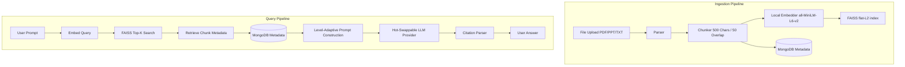

---
title: Learnify AI
emoji: 🎓
colorFrom: blue
colorTo: purple
sdk: docker
pinned: false
---

<p align="center">
  
</p>

<h1 align="center">LEARNIFY AI</h1>

<p align="center">
  
  
  
  
</p>

**Learnify AI is a production-grade, full-stack AI-powered adaptive learning platform designed to transform static study materials (PDFs, PPTs, TXTs) into an interactive, voice-enabled, and emotion-aware personal tutor. Driven by a level-adaptive RAG pipeline and a suite of interactive educational mini-games, the system continuously adjusts to each student’s cognitive and emotional states in real-time. Deployable completely offline for total data privacy, it offers hot-swappable multi-LLM orchestration with no server downtime.**

---

## Feature Matrix

| Feature | Description | Status |
|---|---|---|
| **RAG Q&A with Citations** | Natural language chat with documents returning cited answers mapping to source files and page numbers. | ✅ Active |
| **Adaptive Quiz Engine** | Dynamic question generator that auto-scales difficulties (1–5) per topic based on a rolling 0–100 score. | ✅ Active |
| **Knowledge Graph** | D3.js force-directed concept visualizer powered by offline NLTK noun-phrase extraction and top-40 pruning. | ✅ Active |
| **Voice Input & Output** | Local Whisper speech-to-text (STT) for voice questions and gTTS text-to-speech (TTS) supporting 40+ languages. | ✅ Active |
| **Webcam Emotion Detection** | Real-time facial expression analysis (DeepFace + OpenCV) over WebSockets with 5-frame smoothing and adaptive interventions. | ✅ Active |
| **Gamification** | Granular event-based XP system, streaks, and badges (*Week Warrior*, *Century Scholar*, *Knowledge Knight*, *Learning Legend*). | ✅ Active |
| **6 Content-Driven Mini-Games** | *Snake Quiz*, *Tic-Tac-Toe vs AI*, *Memory Match*, *Word Scramble*, *Falling Quiz*, and *Flashcard Flip* powered by uploaded material. | ✅ Active |
| **Privacy Mode** | Forces local offline LLM routing via Ollama, throwing a `RuntimeError` immediately if cloud fallbacks are attempted. | ✅ Active |
| **Runtime Multi-LLM Swap** | Hot-swap between Google Gemini 2.0, Groq LLaMA 3, and Ollama at runtime without restarting the server. | ✅ Active |
| **Zero-API Multilingualism** | Prompt-driven language switching that bypasses dedicated translation APIs. | ✅ Active |
| **Learning Goals Tracker** | Deadline-driven milestones, concept completion rates, and AI-generated study plans cached for 24 hours. | ✅ Active |
| **Document Library** | Subject-grouped document organization with vector deletions synced instantly to FAISS index. | ✅ Active |
| **JWT Authentication** | Secure stateless authentication featuring bcrypt passwords, refresh endpoints, and revoked-token TTL collection. | ✅ Active |
| **Analytics Dashboard** | Rich data visualizations tracking daily velocity, weak topics, knowledge retention curves, and aggregated sessions. | ✅ Active |
| **FAISS Auto-Rebuild** | Startup sync mechanism that regenerates missing vector index embeddings from MongoDB collections. | ✅ Active |

---

## Why This Tech Stack?

| Layer | Chosen Technology | Rejected Alternatives | Technical Rationale & Trade-offs |
|---|---|---|---|
| **Backend API** | **FastAPI** | Flask, Django | FastAPI provides native async support required to handle concurrent LLM streams and high-throughput WebSockets. It also enforces strict boundary safety using Pydantic validation. |
| **RAG Pipeline** | **LangChain + FAISS** | Pinecone, Weaviate | LangChain provides provider-agnostic abstractions for single-line LLM swapping. FAISS runs fully in-process without infrastructure overhead, API cost, or network latency for datasets under ~100k chunks. |
| **Embeddings** | **sentence-transformers (`all-MiniLM-L6-v2`)** | OpenAI Embeddings | `all-MiniLM-L6-v2` produces dense 384-dimensional vectors fully offline. This avoids external API bills, minimizes latency via CPU-optimized inference, and guarantees zero data leakage. |
| **Database** | **MongoDB (Motor async)** | PostgreSQL, SQLite | Study paths, games, and quizzes require highly polymorphic document shapes. Motor provides non-blocking async operations that prevent Event Loop starvation. |
| **Orchestration** | **Gemini + Groq + Ollama** | Closed Single-Vendor (e.g. OpenAI) | A three-tier strategy (Gemini for reasoning quality, Groq for ultra-fast free tier generation, and Ollama for absolute privacy) avoids vendor lock-in and mitigates cloud outage risks. |
| **Frontend** | **React 19 + Vite + Tailwind 4** | Next.js, Webpack, Tailwind 3 | React 19 concurrent features ensure responsive interfaces during heavy network rendering. Vite yields sub-second hot module replacement. Tailwind 4 compiles zero-runtime CSS utility classes. |
| **Voice Processing** | **Whisper (Local) + gTTS** | Cloud speech APIs | Whisper STT runs locally to ensure students' voices are never uploaded to commercial servers. gTTS offers native support for over 40 languages without translation overhead. |
| **Emotion Analysis** | **DeepFace + OpenCV** | Azure Face API, AWS Rekognition | Eliminates biometric subscription costs and guarantees that live webcam streams are parsed entirely in-process on the local machine. |
| **Graph Processing** | **NLTK + NetworkX + D3.js** | Neo4j, LLM-based extraction | Extracts noun phrases locally using heuristics rather than calling expensive LLM APIs, constructs relationships dynamically using NetworkX, and renders interactively via D3.js. |

---

## Problems Solved & Technical Decisions

1. **LLM Provider Hot-Swapping without Server Restart**
   - **Problem**: Switching between Gemini, Groq, and Ollama typically requires restarts or configuration modifications.
   - **Solution**: Implemented a global mutable singleton `runtime_config` mapping current settings. The API endpoint changes providers via `set_provider()`, and all downstream LLM invocations dynamically resolve the configuration through the model factory `get_llm()`.
   - **Files & Functions**: [`backend/rag/llm_provider.py`](file:///c:/Users/Shafia/PROJECTS/Learnify-AI/backend/rag/llm_provider.py) (`get_llm()`, `set_provider()`, `runtime_config`), [`backend/routers/settings.py`](file:///c:/Users/Shafia/PROJECTS/Learnify-AI/backend/routers/settings.py).

2. **Privacy Mode Enforcement**
   - **Problem**: Preventing cloud data leakage when a student requests total offline operation.
   - **Solution**: When `PRIVACY_MODE` is enabled, the provider factory `get_llm()` intercepts LLM instantiations and forces all requests through local Ollama. If a non-Ollama LLM (Gemini or Groq) is selected or fallback is triggered, it raises a strict `RuntimeError` to block cloud execution.
   - **Files & Functions**: [`backend/rag/llm_provider.py`](file:///c:/Users/Shafia/PROJECTS/Learnify-AI/backend/rag/llm_provider.py) (`get_llm()`), [`backend/config.py`](file:///c:/Users/Shafia/PROJECTS/Learnify-AI/backend/config.py).

3. **Adaptive Quiz Difficulty Without User Tagging**
   - **Problem**: Generating quiz questions that match the user's proficiency level per topic without manual sorting.
   - **Solution**: Tracks a student's rolling quiz performance score (0-100) per topic in MongoDB. The function `get_difficulty_level()` maps these scores to a scale of 1-5. Quizzes are generated by querying existing questions within the calculated difficulty range; if insufficient questions are cached, the LLM is requested to generate questions at that specific difficulty.
   - **Files & Functions**: [`backend/quiz/difficulty_engine.py`](file:///c:/Users/Shafia/PROJECTS/Learnify-AI/backend/quiz/difficulty_engine.py) (`get_difficulty_level()`), [`backend/quiz/adaptive_selector.py`](file:///c:/Users/Shafia/PROJECTS/Learnify-AI/backend/quiz/adaptive_selector.py) (`get_adaptive_quiz()`), [`backend/quiz/generator.py`](file:///c:/Users/Shafia/PROJECTS/Learnify-AI/backend/quiz/generator.py) (`generate_quiz()`).

4. **Knowledge Graph Scalability & Cost Mitigation**
   - **Problem**: Massive files cause massive, cluttered graphs that slow down browsers, and extraction via LLM is prohibitively slow and expensive.
   - **Solution**: Replaced LLM extraction with an offline NLTK-based noun-phrase chunker. Vertices represent concepts, and edges represent text-chunk co-occurrences. Graph clutter is solved by top-40 concept pruning based on frequency and degree centrality.
   - **Files & Functions**: [`backend/rag/knowledge_graph.py`](file:///c:/Users/Shafia/PROJECTS/Learnify-AI/backend/rag/knowledge_graph.py) (`generate_knowledge_graph()`), [`backend/routers/query.py`](file:///c:/Users/Shafia/PROJECTS/Learnify-AI/backend/routers/query.py).

5. **Stale FAISS Index on Ephemeral Deployments (e.g. Hugging Face Spaces)**
   - **Problem**: Ephemeral container restarts erase local FAISS flat files while persistent metadata collections remain intact in MongoDB.
   - **Solution**: Implemented `sync_faiss_with_db()`. On startup, if FAISS files are missing, the system scans MongoDB for chunks, embeds them locally, maps integer positions to chunk IDs using a JSON sidecar file, and rebuilds the vector index on the fly.
   - **Files & Functions**: [`backend/vector_store.py`](file:///c:/Users/Shafia/PROJECTS/Learnify-AI/backend/vector_store.py) (`sync_faiss_with_db()`, `_load_index()`, `_save_sidecar()`).

6. **Real-time Webcam Emotion Processing Without Frame Latency**
   - **Problem**: DeepFace inference takes up to 1.5 seconds per frame, which freezes live video streams if run synchronously.
   - **Solution**: Separated OpenCV frame preview from deep learning execution. The client pushes raw frames over WebSockets. The backend draws and responds at 30 FPS, while a separate background task evaluates every 1.5 seconds and passes results to a non-blocking shared dictionary with a 5-frame smoothing queue.
   - **Files & Functions**: [`backend/routers/websocket.py`](file:///c:/Users/Shafia/PROJECTS/Learnify-AI/backend/routers/websocket.py) (`websocket_endpoint()`).

7. **Multilingual LLM Responses Without Translation API Costs**
   - **Problem**: Supporting global learners without subscribing to Google Translate or DeepL API endpoints.
   - **Solution**: The user's language selection is passed as a variable directly to the system prompt template. The LLM is instructed to process references and format output citations inside the requested target language natively.
   - **Files & Functions**: [`backend/rag/prompts.py`](file:///c:/Users/Shafia/PROJECTS/Learnify-AI/backend/rag/prompts.py), [`backend/rag/llm_chain.py`](file:///c:/Users/Shafia/PROJECTS/Learnify-AI/backend/rag/llm_chain.py) (`generate_answer()`).

8. **Educational Mini-Game Content Synthesis**
   - **Problem**: Tailoring mini-games (e.g. Word Scramble, Snake) to the student's text files without human manual authoring.
   - **Solution**: Samples random text chunks from MongoDB and queries the LLM to construct multiple-choice pairs or flashcards. For Word Scramble, `word_extractor.py` uses heuristic filters (word lengths of 5-12 characters, regex patterns) to extract key vocabulary directly from chunks offline without LLM calls.
   - **Files & Functions**: [`backend/games/content_generator.py`](file:///c:/Users/Shafia/PROJECTS/Learnify-AI/backend/games/content_generator.py) (`generate_game_content()`), [`backend/games/word_extractor.py`](file:///c:/Users/Shafia/PROJECTS/Learnify-AI/backend/games/word_extractor.py) (`extract_educational_words()`), [`backend/routers/games.py`](file:///c:/Users/Shafia/PROJECTS/Learnify-AI/backend/routers/games.py).

9. **Atomic Concurrent Ingestion Pipeline**
   - **Problem**: File parsing, text chunking, embedding generation, vector database insertion, and document database metadata mapping must run concurrently without leaving dangling temporary files if exceptions occur.
   - **Solution**: Orchestrated ingestion as an atomic async pipeline (parse → chunk at 500 chars / 50 overlap → embed → FAISS index write → MongoDB document creation). All temporary files are systematically purged using structured `finally` statements.
   - **Files & Functions**: [`backend/routers/ingest.py`](file:///c:/Users/Shafia/PROJECTS/Learnify-AI/backend/routers/ingest.py) (`upload_document()`), [`backend/chunker.py`](file:///c:/Users/Shafia/PROJECTS/Learnify-AI/backend/chunker.py).

10. **Bidirectional Deletion Synced to FAISS Index**
    - **Problem**: Removing a document or subject should instantly update the vector space to prevent ghost retrievals, but FAISS does not natively support string key mapping.
    - **Solution**: Implemented a lookup mapping sequence numbers in the flat index to MongoDB chunk ID strings inside a sidecar JSON file. The function `remove_from_index()` maps deleted MongoDB documents to target integer indices, triggers `index.remove_ids()`, rebuilds the mapping sidecar, and persists the updates.
    - **Files & Functions**: [`backend/vector_store.py`](file:///c:/Users/Shafia/PROJECTS/Learnify-AI/backend/vector_store.py) (`remove_from_index()`, `_save_sidecar()`), [`backend/routers/documents.py`](file:///c:/Users/Shafia/PROJECTS/Learnify-AI/backend/routers/documents.py) (`delete_document()`).

---

## System Architecture

Learnify AI leverages a decoupled, event-driven architecture split into two primary pipelines.



> [!NOTE]
> The full architectural design and detailed process maps can be accessed at [`docs/architecture.md`](file:///c:/Users/Shafia/PROJECTS/Learnify-AI/docs/architecture.md).

---

## Prerequisites

- **Python 3.11+**
- **Node.js 20+**
- **MongoDB**
- **Ollama** *(optional, for local offline execution)*

---

## Getting Started

### Quick Start

```bash
git clone https://github.com/Shafia-01/Learnify-AI.git
cd Learnify-AI
cp backend/.env.example backend/.env
# Edit backend/.env to include MONGODB_URI and GEMINI_API_KEY
npm install --prefix frontend && pip install -r backend/requirements.txt
```

### 1. Backend Setup

```bash
cd backend
python -m venv venv
# Windows:
venv\Scripts\activate
# macOS / Linux:
source venv/bin/activate
pip install -r requirements.txt
```

### 2. Frontend Setup

```bash
cd frontend
cp .env.example .env
npm install
```

### 3. Running Locally

Open **two separate terminals**:

**Terminal 1 — Backend API Server:**
```bash
cd backend
uvicorn main:app --reload --host 0.0.0.0 --port 8000
```

**Terminal 2 — Frontend Dev Server:**
```bash
cd frontend
npm run dev
```

---

## Environment Variables

### Backend (`backend/.env`)

| Variable | Description | Default | Required? |
|---|---|---|---|
| `GEMINI_API_KEY` | Google Gemini API key | — | Optional |
| `GROQ_API_KEY` | Groq API key | — | Optional |
| `MONGODB_URI` | MongoDB connection string | `mongodb://localhost:27017/learnify` | **Yes** |
| `OLLAMA_BASE_URL` | Ollama local URL | `http://localhost:11434` | Optional |
| `FAISS_INDEX_PATH` | Path to FAISS index | `./faiss_index` | Optional |
| `PRIVACY_MODE` | Enable offline mode | `false` | Optional |

### Frontend (`frontend/.env`)

| Variable | Description | Default | Required? |
|---|---|---|---|
| `VITE_API_BASE_URL` | Backend API base URL | `http://localhost:8000` | Optional |

---

## API Reference

| Endpoint Prefix | Purpose | Key Sub-Endpoints / Operations |
|---|---|---|
| `/api/ingest` | Document Ingestion | `POST /upload` |
| `/api/query` | RAG & Knowledge Graph | `POST /ask`, `GET /learning-path/{id}`, `GET /knowledge-graph/{id}` |
| `/api/quiz` | Quiz & Adaptive Engine | `POST /generate`, `POST /submit`, `GET /flashcards/{id}` |
| `/api/gamification` | User Progress | `GET /profile/{id}`, `POST /award/{id}`, `GET /leaderboard` |
| `/api/auth` | Stateless JWT Sessions | `POST /register`, `POST /login`, `GET /me` |
| `/api/voice` | Voice I/O Utilities | `POST /transcribe`, `GET /speak` |
| `/api/games` | Gamified Learning Content | `GET /word-scramble/{id}`, `POST /score`, `GET /leaderboard/{game}` |
| `/api/settings` | Server Configuration | `GET /status`, `POST /provider`, `POST /privacy` |
| `/api/goals` | Milestone Tracking | `POST /create`, `GET /{user_id}`, `GET /{goal_id}/daily-plan` |
| `/ws/emotion/{session_id}` | Facial Analysis | WebSocket Connection Stream |

---

## Known Limitations

- **Ollama Privacy Mode**: Requires a locally configured and active Ollama instance. It is unavailable on environments lacking local compute resources (e.g. Hugging Face Spaces or Serverless Cloud runtimes).
- **Compute Overhead**: Local Whisper speech-to-text models and OpenCV/DeepFace emotion analysis run heavily on local CPU/RAM. Performance will degrade on low-end machines.
- **NLTK Limitations**: The noun-phrase extraction uses heuristic pattern parsing, which may occasionally miss complex, multi-word academic terminology.
- **Webcam Constraints**: Facial emotion detection reliability decreases under low-light conditions or when users wear reflective glasses.
- **Vector Scale Limits**: The flat FAISS index (`IndexFlatL2`) executes exact exhaustive search. Beyond ~100k chunks, it should be migrated to `IndexIVFFlat` or a distributed vector service.

---

## License

MIT License — Educational Use
