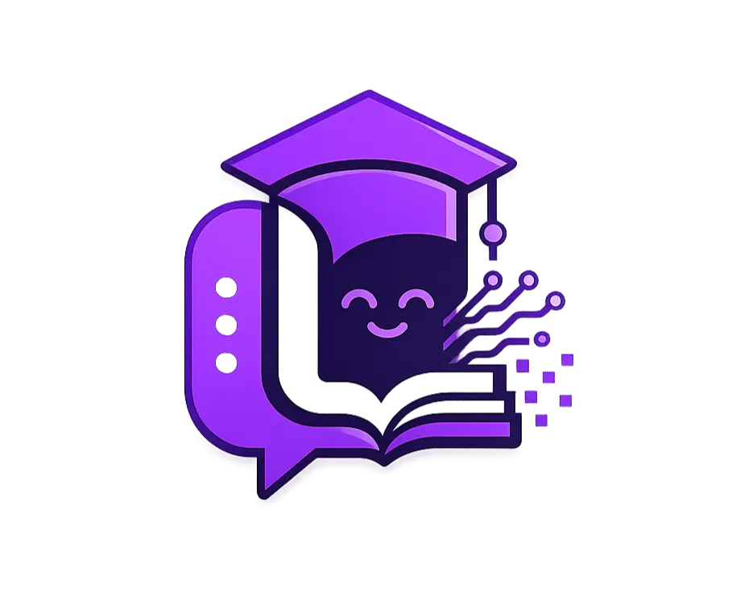
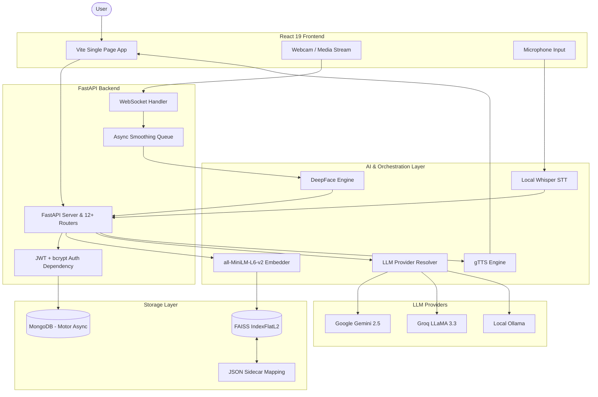

<p align="center">
  
</p>

<h1 align="center">Learnify AI</h1>
<p align="center"><strong>AI That Learns How You Learn</strong></p>

Learnify AI is a production-grade, full-stack AI-powered adaptive learning platform designed to transform static study materials—such as PDFs, PPTs, and text documents—into interactive, voice-enabled, and emotion-aware personal tutoring sessions. The platform implements a custom level-adaptive Retrieval-Augmented Generation (RAG) pipeline alongside dynamic educational mini-games, continuously tailoring content to a student's cognitive capability and emotional state in real time. Architected with a strong focus on data privacy, the system supports fully offline local deployment, zero-downtime hot-swappable multi-LLM orchestration, and bidirectional database-vector synchronization.

[](https://www.python.org/)
[](https://fastapi.tiangolo.com/)
[](https://react.dev/)
[](https://www.mongodb.com/)
[](https://github.com/facebookresearch/faiss)
[](https://www.langchain.com/)
[](https://github.com/openai/whisper)
[](https://github.com/serengil/deepface)

<!--[Live Demo →](Link-here) -->

<!-- ADD DEMO VIDEO / GIF HERE -->
<!-- Example:  -->

---

## What Makes This Different

* **Not a Tutorial Project:** Unlike generic wrapper applications, this platform addresses real-world distributed systems and machine learning integration problems, including state synchronization, edge compute bottlenecks, and hard privacy boundaries.
* **Production Engineering Solutions:** Implements robust custom mechanisms for synchronizing in-memory vector databases with persistent document stores, mitigating ephemeral storage loss on serverless deployments.
* **End-to-End Multimodal AI Integration:** Seamlessly combines real-time facial expression analysis over WebSockets, local automatic speech recognition (ASR), and multilingual speech synthesis without relying on expensive, proprietary third-party cloud APIs.
* **Production-Ready Security & Safeguards:** Features server-side JSON Web Token (JWT) verification, token revocation tracking via MongoDB Time-To-Live (TTL) collections, and strict dependency injection to protect resources from unauthorized access and API abuse.

---

## Core Features

### 1. Adaptive Learning Engine
* **Contextual RAG with Citations:** Ingests unstructured academic materials, runs document-to-vector embedding pipelines, and delivers responses containing precise document and page-number citations mapped back to the source records.
* **Multi-Tier Prompt Adaptation:** Dynamically updates system instructions based on the student's current proficiency level (beginner, intermediate, or advanced) to adjust concept complexity and detail level.
* **5-Tier Difficulty-Gated Quizzing:** Automatically selects and displays multiple-choice, fill-in-the-blank, or short-answer questions tailored to a rolling performance metric calculated from user responses.
* **Dynamic Concept Sequencing:** Automatically maps ingested files into a structured learning path, using LLM-based sequence planning to order concepts logically.

### 2. Multimodal AI Integrations
* **Low-Latency Facial Emotion Analysis:** Establishes a WebSocket connection to stream webcam frames, running biometrics asynchronously using DeepFace to deliver contextual interventions when the student shows frustration or confusion.
* **On-Device Automatic Speech Recognition (ASR):** Runs a local Whisper instance to transcribe student voice questions, allowing fully offline voice-driven navigation and learning.
* **Zero-Translation Multilingual Synthesis:** Generates high-quality spoken explanations using gTTS for over 40 languages, prompting the LLM to format responses natively in the student's language without external translation layers.

### 3. Gamification & Analytics
* **Granular Progress Tracker:** Calculates experience points (XP) based on session activity, tracks consecutive daily login streaks, and awards specific achievement badges based on learning milestones.
* **Adaptive Educational Mini-Games:** Feeds document context into six dynamic frontend games (*Snake Quiz*, *Tic-Tac-Toe vs AI*, *Memory Match*, *Word Scramble*, *Falling Quiz*, and *Flashcard Flip*) using local text parsers and LLM generators.
* **Interactive Concept Visualization:** Utilizes NLTK for local noun-phrase extraction and NetworkX to build a force-directed concept graph, rendered interactively on the frontend using D3.js.
* **Recharts Analytics Dashboard:** Visualizes daily velocity, topic strengths, knowledge retention curves, and aggregated study duration metrics using React charts.

### 4. Platform & Infrastructure
* **Stateful Sync on Ephemeral Hosts:** Monitors vector index file availability on startup, automatically pulling document chunks from MongoDB and rebuilding the local FAISS index on container restarts.
* **Runtime LLM Hot-Swapping:** Allows users to switch active AI model providers (Google Gemini, Groq, or Ollama) dynamically at runtime without causing backend server downtime.
* **Enforced Local Privacy Mode:** Provides a toggle to route all vector ingestion, storage, and generation operations through local Ollama instances, blocking cloud requests with runtime errors.
* **Containerized Deployment Pipeline:** Utilizes a multi-stage Docker build to package both the React 19 frontend and the FastAPI backend, optimized for automatic deployment via GitHub Actions to HuggingFace Spaces.

---

## System Architecture

The application is architected around decoupled pipelines that isolate CPU-bound machine learning tasks, I/O-bound database queries, and real-time state synchronization.



---

## Tech Stack Decisions

| Technology | Role | Why Chosen (Engineering Rationale & Trade-offs) |
| :--- | :--- | :--- |
| **FastAPI** | Backend API Framework | Provides high-performance, non-blocking asynchronous event handling necessary for managing WebSockets and streaming LLM responses, while enforcing strict request schema boundaries via Pydantic. |
| **LangChain + FAISS** | RAG Orchestration & Vector DB | LangChain abstracts model-specific details to support runtime swapping, while FAISS provides a lightweight, in-memory flat vector index that runs entirely in-process to eliminate database hosting costs and API overhead. |
| **all-MiniLM-L6-v2** | Local Text Embeddings | A compact 384-dimensional sentence-transformer model that runs locally on commodity CPU hardware, reducing vector storage sizes and ensuring user documents are never uploaded to external servers. |
| **Motor (MongoDB)** | Asynchronous Database Client | Polymorphic structures such as quizzes, custom badges, and learning paths fit naturally into a document-oriented database, while Motor's async driver prevents blocking the FastAPI event loop during heavy operations. |
| **Gemini / Groq / Ollama** | Tri-Tier LLM Orchestration | Creates a fallback chain that balances reasoning performance (Gemini), sub-second text generation latency (Groq), and absolute data privacy during local offline execution (Ollama). |
| **React 19 + Vite + Tailwind 4** | Frontend Stack | React 19's concurrent features prevent UI lag during real-time data streaming, Vite delivers sub-second development builds, and Tailwind v4 offers compiled CSS styling with zero runtime overhead. |
| **Whisper (Local) + gTTS** | Speech-to-Text & Text-to-Speech | Local Whisper instances transcribe user voice inputs locally to protect user privacy, while gTTS provides broad multilingual audio output capabilities without licensing costs. |
| **DeepFace + OpenCV** | Facial Expression Analysis | Allows facial landmark extraction and classification directly on raw webcam frames without exposing biometric data to cloud-based facial recognition APIs. |
| **NLTK + NetworkX + D3.js** | Concept Extraction & Visualization | Performs noun-phrase extraction using NLTK patterns locally to avoid expensive LLM indexing costs, models concepts in NetworkX, and renders interactive graphs using D3 force simulations. |

---

## Engineering Highlights

### 1. Stateful Sync for Ephemeral Containers
When deploying to stateless hosting platforms like HuggingFace Spaces, container restarts wipe local storage, including the FAISS index files, while the MongoDB database persists externally. To solve this, `sync_faiss_with_db()` triggers automatically on startup, verifying index integrity. If index files are missing or out of sync, the system fetches all document chunks from MongoDB, generates embeddings using the local sentence-transformer model, writes the vector database, and rebuilds the JSON sidecar. This ensures zero data loss and immediate availability of the RAG pipeline after container restarts.

### 2. Strict Privacy Mode Enforcement
To prevent cloud data leakage during sensitive operations, the system implements a strict privacy barrier. When Privacy Mode is enabled, the provider factory `get_llm()` intercepts all downstream LLM calls and forces routing to the local Ollama instance. If a user attempts to call a cloud provider (such as Gemini or Groq) while Privacy Mode is active, the system raises a `RuntimeError` immediately rather than failing silently or falling back to a cloud model. This ensures that no raw user text, document chunks, or metadata leave the local host environment.

### 3. Decoupled Real-Time Emotion Interventions
Processing facial emotions using deep learning models typically introduces processing latency (up to 1.5 seconds per frame), which would block standard WebSocket connections. The platform resolves this by decoupling the 30 FPS video preview stream from the emotion analysis engine. Webcam frames are pushed to the server via WebSockets and immediately returned to keep the video UI smooth. Simultaneously, a separate background worker thread samples frames every 1.5 seconds, running DeepFace inference asynchronously, pushing results to a 5-frame majority-vote queue to smooth out transient expressions, and delivering adaptive UI changes without affecting the video stream.

### 4. Bidirectional Vector-Document Synchronization
Because FAISS does not natively support mapping string document IDs to its index keys, deleting a file from the database could result in stale embeddings returning during RAG operations. To address this, the backend maps FAISS integer sequence offsets to MongoDB document chunk IDs using a JSON sidecar file. When a user deletes a document, `remove_from_index()` reads the sidecar, maps the target chunk IDs to their exact integer positions in the FAISS index, calls `index.remove_ids()`, rebuilds the mapping sidecar, and saves the changes, ensuring immediate consistency across the database and search index.

### 5. Multi-LLM Resolution & Model Migration
To prevent service interruptions caused by upstream API model deprecations, the system resolves LLM calls dynamically per request. The function `get_llm_for_user(user_doc)` reads user-specific provider settings from MongoDB and falls back to global settings if necessary. It also acts as an abstraction layer for model name mapping, translating deprecated Gemini and Groq model strings (e.g., mapping outdated legacy models to Gemini 2.5 and LLaMA 3.3) dynamically. This ensures that the frontend can call a stable API interface without requiring updates when cloud model versions change.

---

## Quick Start

### Installation & Run

Clone the repository and prepare the environment configuration:
```bash
git clone https://github.com/Shafia-01/Learnify-AI.git
cd Learnify-AI
cp backend/.env.example backend/.env
# Open backend/.env and configure MONGODB_URI and at least one LLM API key
```

Set up and run the FastAPI Backend:
```bash
# Navigate to the backend directory
cd backend
python -m venv venv

# Activate the virtual environment
# On Windows:
venv\Scripts\activate
# On macOS/Linux:
# source venv/bin/activate

# Install dependencies and start the API server
pip install -r requirements.txt
uvicorn main:app --reload --port 8000
```

Set up and run the React Frontend (in a new terminal):
```bash
# Navigate to the frontend directory
cd frontend
npm install
npm run dev
```

### Core Environment Variables

| Variable | Required | Description |
| :--- | :--- | :--- |
| `MONGODB_URI` | **Yes** | Connection string for the MongoDB instance (local or Atlas). |
| `GEMINI_API_KEY` | No | Google AI Studio key, required if using Gemini models. |
| `GROQ_API_KEY` | No | Groq API key, required if using Groq cloud models. |
| `OLLAMA_BASE_URL` | No | Endpoint url for local Ollama instance (defaults to `http://localhost:11434`). |
| `PRIVACY_MODE` | No | Boolean flag (`true`/`false`) to force all LLM generation offline. |

---

## Project Structure

```
backend/
  rag/           # Context retrieval, LLM generation chain, knowledge graph, prompt templates
  quiz/          # Adaptive selector, difficulty evaluation engine, MCQ generators
  gamification/  # XP engine, streak trackers, badge accomplishment systems
  games/         # Game content synthesis and local vocabulary extraction
  voice/         # Local Whisper ASR wrapper and multilingual gTTS utilities
  routers/       # 12+ REST endpoints (ingestion, query, quiz, settings, auth, web sockets)
  models/        # Pydantic schemas validating all request/response payloads

frontend/src/
  pages/         # 12 application views (Analytics, ML Monitor, Library, Settings, etc.)
  components/    # Shared UI blocks (EmotionPanel, D3-based KnowledgeGraphEnhanced, etc.)
  api/           # Axios clients configured for typed API endpoints
```

---

## Why This Project?

Learnify AI is not a generic tutorial application. It represents a fully integrated, production-ready AI software product featuring 12+ REST endpoints, secure token-revocation authentication, 3-tier LLM orchestration with hot-swapping capabilities, WebSocket-based biometrics, and a local RAG pipeline synced with a document database. Every architectural decision—from decoupling the CPU-bound DeepFace pipeline to implementing transactional vector indexing—reflects real-world software engineering trade-offs between performance, privacy, API cost, and developer complexity.

---

## Roadmap

- **IndexIVFFlat Vector Scaling:** Migrate the current flat FAISS index to an inverted file index (`IndexIVFFlat`) to maintain sub-millisecond retrieval speeds as document chunks scale beyond 100k records.
- **Multi-User Vector Isolation:** Introduce dedicated namespace partitioning or isolated FAISS files per user to guarantee absolute data separation in multi-tenant environments.
- **Spaced Repetition Engine:** Implement a SuperMemo-2 (SM-2) algorithm to schedule adaptive quizzes, optimizing long-term information retention.
- **Automated RAG Evaluation:** Integrate an offline evaluation harness to measure context relevance and generation faithfulness using Ragas or custom scoring models.
- **Mobile Responsive Redesign:** Complete a comprehensive styling pass across all 12 dashboard views to ensure full usability on mobile web browsers.
- **Server-Sent Events (SSE):** Re-engineer the query and chat API endpoints to support token-by-token text streaming for improved user experience.

---

## License

MIT License - Educational and Portfolio Use
