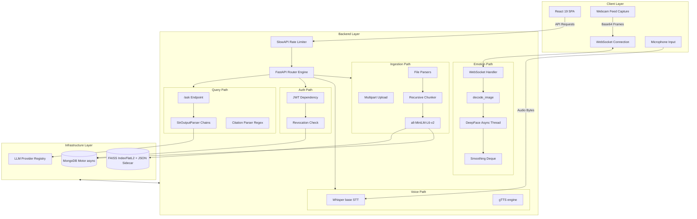

# Learnify AI Architecture Reference

## System Overview

Learnify AI is a production-grade full-stack AI-powered adaptive learning platform. The system delivers customized learning paths through retrievable academic context, real-time webcam-based emotion tracking, and customized quiz generation.

The codebase is built on four core architectural principles:
- Local-First Machine Learning Inference: Privacy-sensitive machine learning calculations run entirely on the local device. This includes audio transcription via `whisper` and facial emotion detection via `deepface`, ensuring biometric and voice data do not leak to external cloud services.
- Provider-Agnostic LLM Layer: A central translation registry isolates downstream business logic from specific cloud model APIs, allowing hot-swapping between Google Gemini, Groq, and local Ollama models.
- Async-First Application Server: High-concurrency operations, such as chunk streaming and WebSocket connections, are handled asynchronously via FastAPI and Motor.
- User-Scoped Vector Retrieval: Security boundaries are maintained at the database query layer by scoping FAISS nearest-neighbor searches to specific user identifiers.

## High-Level Architecture Diagram

The platform splits execution concerns into three separate logical layers.



## RAG Pipeline

The RAG pipeline provides context injection by parsing, indexing, and retrieving course materials.

### Ingestion Pipeline

The ingestion pipeline transforms raw documents into searchable semantic structures.

| Stage | Implementation | Why |
|---|---|---|
| Parsing | `pdfplumber` for page-by-page extraction, `python-pptx` for shape and slide iteration, and paragraph splitting on double newlines for plain text files. | Layout-aware extraction. Using `pdfplumber` isolates structural page breaks and extracts academic text blocks more reliably than `PyPDF2`. |
| Chunking | `RecursiveCharacterTextSplitter` configured for 500 characters with a 50 character overlap. | Granular text sizing. Chunks of 500 characters fit comfortably within LLM context windows while preserving sentence coherence, and the 50 character overlap maintains context across split boundaries. |
| Embedding | `all-MiniLM-L6-v2` SentenceTransformer generating 384-dimensional floating point vectors. | Local resource efficiency. The model runs fully offline, has a small footprint of 74MB, and provides adequate semantic mapping for text without API fees or latency. |
| Vector Storage | `faiss.IndexFlatL2` storing vectors in-memory. | Low latency and low overhead. Exact L2 similarity searches run in sub-millisecond times for small scale environments, removing the need for a standalone vector database. |
| Metadata Storage | MongoDB `chunks` collection storing the document text, subject, filename, and chunk identifier. | Decoupled queries. Metadata query filtering operates within MongoDB, allowing the system to run vector searches without re-embedding or pre-filtering. |

Vector indexing uses a decoupled design. Since `faiss` does not store metadata natively within `IndexFlatL2`, the system writes a parallel JSON sidecar mapping file to disk at `FAISS_INDEX_PATH.json`. This sidecar holds an ordered list of string `chunk_id` values. When a vector is inserted, its position in the FAISS array matches its position in the JSON sidecar list. To delete chunks, the function `remove_from_index()` maps string `chunk_id` values to integer positions using the sidecar, calls `index.remove_ids()` with those indices, and updates the sidecar file.

### Query Pipeline

The query pipeline executes a 7-stage sequence to generate referenced responses.

1. Query Embedding: The user query text is sent to the shared `all-MiniLM-L6-v2` model. Matching the exact model used for ingestion is required to ensure query vectors exist in the same vector space.
2. Vector Search: The query vector is queried against the local `faiss` index via `search_index()`. If a user identifier is present, the system requests 50 nearest-neighbor candidate indices to allow for post-retrieval filtering. If no user identifier is present, the system requests the target count directly.
3. Metadata Identification: The returned integer array indices are converted to string `chunk_id` values using the sidecar file.
4. Security Filtering: The system queries the MongoDB `chunks` collection with the candidate `chunk_id` list and applies a filter matching the current `user_id`.
5. Score Reordering: MongoDB returns matching documents out of order. The backend sorts the retrieved database documents to restore the ascending distance order established by the initial FAISS search.
6. Context Synthesis: The text content of the nearest neighbor chunks is injected into the selected prompt template along with target language rules. The system selects `BEGINNER_PROMPT`, `INTERMEDIATE_PROMPT`, or `ADVANCED_PROMPT` depending on the user preference.
7. Prompt Processing and Citation Extraction: The active LLM generates an answer, which is parsed with a regular expression matching the sources block. The final JSON payload returns the clean answer and deduplicated citation dictionary objects.

### User-Scoped Retrieval

Scoping retrieval requests by `user_id` prevents unauthorized data access between users. Because FAISS searches are performed globally on a shared server-side index, candidate filtering occurs immediately after vector retrieval. By fetching a larger candidate window of 50 items, the query engine accommodates document filtering inside MongoDB without suffering from under-retrieval. The filtered results are then sorted to match the original FAISS metric order before the top 5 chunks are selected.

## LLM Provider Architecture

The LLM interface resolves model connections at runtime.

### Runtime Config Singleton

A system-wide mutable dictionary named `runtime_config` tracks configuration states:

```python
runtime_config = {
    "provider": "groq",
    "gemini_model": "gemini-2.5-flash-lite",
    "groq_model": "llama-3.1-8b-instant",
    "ollama_model": "llama3",
    "privacy_mode": settings.PRIVACY_MODE
}
```

The system uses `runtime_config` to allow live changes to the active LLM provider, active models, and privacy enforcement states without requiring application restarts.

### Provider Resolution Chain

The function `get_llm()` determines which chat model to instantiate:

```
get_llm() resolution order:
1. Check if runtime_config["privacy_mode"] is True:
   - Returns ChatOllama instance
   - If initialization fails, raises RuntimeError immediately to prevent cloud fallbacks
2. Check if runtime_config["provider"] is "gemini":
   - Returns ChatGoogleGenerativeAI instance
   - Falls back to ChatGroq if an exception is raised during initialization
3. Check if runtime_config["provider"] is "ollama":
   - Returns ChatOllama instance
   - Falls back to ChatGroq if an exception is raised during initialization
4. Default resolution:
   - Returns ChatGroq instance using settings.GROQ_API_KEY
```

For authenticated endpoints, `get_llm_for_user(user_doc)` resolves settings on a per-user basis:

```
get_llm_for_user(user_doc) resolution order:
1. Read user_doc for overrides ("privacy_mode", "llm_provider", "gemini_model", "groq_model", "ollama_model")
2. Fall back to global runtime_config values for any missing keys
3. Execute the standard get_llm() initialization logic with the resolved configuration
```

### Model Name Migration

The function `set_provider()` intercept and map discontinued model identifiers to current equivalents. This prevents saved database preferences from failing when cloud vendors deprecate old names:
- Discontinued Google models, such as `gemini-3.1-flash-lite`, `gemini-2.0-flash-lite`, `gemini-2.0-flash-lite-001`, and `gemini-1.5-flash`, map to `gemini-2.5-flash-lite`.
- Models such as `gemini-2.0-flash`, `gemini-2.0-flash-001`, and `gemini-1.5-pro` map to `gemini-2.5-flash`.
- Groq models such as `llama3-70b-8192` map to `llama-3.3-70b-versatile`.

### Privacy Mode Enforcement

When privacy mode is enabled, the system restricts data flow to the local device. The application forces the resolution chain to return local `ChatOllama` connections. If the local Ollama service is unreachable, the system raises a `RuntimeError` rather than silently reverting to cloud API keys. This prevents silent privacy leaks.

## FAISS Vector Store Design

The vector database maintains local semantic representations.

### Index Architecture

Vector operations are handled by `IndexFlatL2` to perform exact L2 distance comparisons. The index structure is represented by two files on disk:
- `faiss_index`: The binary vector database file.
- `faiss_index.json`: The sidecar file mapping sequential integer index values to string `chunk_id` values.

The system loads these files into memory at startup and writes updates back to disk.

### Insertion

The function `build_or_update_index(embeddings, chunk_ids)` runs in four steps:
1. Loads the existing index file if present, or creates a new `IndexFlatL2` instance.
2. Calls `index.add(embeddings)` to append the floating point vectors to the FAISS index.
3. Extends the sidecar array with the string `chunk_id` list.
4. Writes the updated binary index and the JSON sidecar file to disk.

### Deletion

The function `remove_from_index(chunk_ids_to_remove)` deletes records in four steps:
1. Maps target string `chunk_id` values to their sequential integer array indices by scanning the sidecar file.
2. Calls `index.remove_ids()` with a NumPy array containing the resolved indices.
3. Deletes matching indices from the sidecar list in descending order to avoid index shifts during deletion.
4. Saves both updated files back to disk.

The FAISS method `remove_ids` only supports flat vector index collections. The choice of `IndexFlatL2` over clustered structures allows vector removals without rebuilding the entire database.

### Auto-Rebuild on Startup

Hugging Face Spaces run on ephemeral container file systems that discard local changes on restart. While MongoDB instances persist, the FAISS index file is lost. During startup, the function `sync_faiss_with_db()` checks if the index is missing. If MongoDB contains records, the server queries the text fields, regenerates the embeddings, and recreates the binary index and JSON sidecar files. The backend uses the `SPACE_ID` environment variable to detect Hugging Face containers and routes storage files to the writable `/tmp` directory.

## Adaptive Quiz System

The quiz system generates questions on demand to match learner capabilities.

### Difficulty Engine

The quiz engine tracks and modifies user scores:
- Topic scores are saved in the `users` collection under the `quiz_scores` nested document.
- New users start with a default score of 50.
- Correct answers increase the score by 10 points (capped at 100).
- Incorrect answers decrease the score by 10 points (floored at 0).

The system maps scores to difficulty levels:
- Scores 0 to 30 map to Level 1.
- Scores 31 to 50 map to Level 2.
- Scores 51 to 70 map to Level 3.
- Scores 71 to 85 map to Level 4.
- Scores 86 to 100 map to Level 5.

### Question Selection Flow

Questions are resolved when requested by the frontend:

```
select_next_questions(user_id, n, topic) sequence:
1. Retrieve quiz_scores[topic] from MongoDB (defaults to 50)
2. Map the score to a difficulty level between 1 and 5
3. Query the quiz_questions collection for questions matching the user_id and difficulty level
4. If the database returns fewer than n questions:
   - Calculate the missing count (shortfall)
   - Retrieve a random sample of document chunks matching the user_id from MongoDB
   - Call generate_questions() to request the LLM to generate MCQ and short-answer questions
   - Validate and insert the generated questions into the quiz_questions collection
5. Return the full set of n questions
```

The system lazy-builds the question collection and caches questions for future quiz sessions.

## Authentication & Authorization

The authorization subsystem handles session creation, rate limiting, and access control.

### Registration Flow

When a user registers, the backend writes to two separate databases collections to preserve compatibility:
- `registered_users`: Holds credentials, hashed passwords, active states, and runtime provider configuration.
- `users`: Holds legacy gamification records, XP counts, badge list arrays, and quiz scores.

### Token Lifecycle

Session validation uses JWT tokens:

```
Token Lifecycle:
Login  --> Create JWT with sub=user_id, exp=now+7d (signed using HS256)
API Call --> OAuth2PasswordBearer extracts token from Authorization Header
         --> decode_access_token() verifies signature and expiry
         --> Checks revoked_tokens collection; returns 401 if token is found
         --> Checks registered_users collection; returns 401 if user is missing
         --> Checks user is_active flag; returns 403 if false
Logout --> Inserts token into revoked_tokens with an expires_at value
       --> MongoDB TTL index automatically removes expired tokens (expireAfterSeconds=0)
```

The revoked token collection relies on a TTL index on the `expires_at` field, ensuring the blacklist does not grow indefinitely.

### Rate Limiting

The application uses `SlowAPI` to prevent service abuse. Rate limits are calculated using client IP addresses:
- Ingestion uploads are limited to 5 requests per minute.
- RAG queries are limited to 15 requests per minute.
- Learning path and knowledge graph generations are limited to 10 requests per minute.
- Quiz generations are limited to 10 requests per minute.
- Quiz submissions are limited to 30 requests per minute.

## Emotion Detection System

The emotion tracking subsystem uses computer vision to trigger learning interventions.

### Architecture

The system receives messages through a unified WebSocket endpoint:

```
Path A — Raw Frame (Live Web Camera):
Browser (EmotionPanel.jsx) --> Sends base64 image data every 2 seconds
                           --> cv2.imdecode parses data into a NumPy array
                           --> asyncio.to_thread() runs DeepFace.analyze() in a separate thread
                           --> Appends dominant emotion to a deque buffer (maxlen=5)
                           --> Counter() calculates majority vote (smoothed_emotion)
                           --> EMOTION_MAP translates emotion to learning state
                           --> Returns state and face coordinates to client

Path B — Pre-processed State (Local ML Scripts):
Script (emotion_detector.py) --> Sends processed state directly through websocket
                             --> Skips image parsing and DeepFace calculation steps
                             --> Dispatches intervention rules directly
```

### Intervention Logic

The system translates emotional states into academic adjustments:
- `confusion` maps to a `simplify` intervention. The backend decreases the user quiz score to lower the difficulty level and suggests simplified content.
- `fatigue` maps to a `break` intervention. The client displays a recommendation to take a break. Topic scores are not modified.
- `frustration` maps to an `analogy` intervention. The tutor provides a simplified analogy. Topic scores are not modified.
- `attention` triggers no intervention.

The system pre-computes valid state values in `_VALID_STATES` at the module level, preventing runtime validation overhead during WebSocket streaming.

### Smoothing

Biometric calculations can return noisy results. The backend assigns a `deque(maxlen=5)` buffer to each session. The system evaluates the last 5 frames and applies a majority vote to determine the smoothed emotional state, preventing rapid or incorrect intervention triggers.

## Database Schema

The MongoDB instance holds 11 collections:

| Collection | Key Fields | Indexes | Purpose |
|---|---|---|---|
| `registered_users` | `user_id`, `username`, `email`, `hashed_password`, `is_active`, `xp`, `badges`, `llm_provider` | `email` (unique), `username` (unique) | Holds auth configurations and user data. |
| `users` | `user_id`, `name`, `xp`, `badges`, `streak_days`, `quiz_scores`, `last_active_date` | None | Backward-compatible gamification store. |
| `chunks` | `chunk_id`, `user_id`, `subject`, `source_file`, `source_type`, `page_or_timestamp`, `text`, `embedding_id` | Implicit index on `user_id` | Stores text fragments. |
| `quiz_questions` | `question_id`, `user_id`, `question_text`, `question_type`, `options`, `correct_answer`, `difficulty` | Compound index on `user_id` + `difficulty` | Stores the question bank. |
| `quiz_attempts` | `attempt_id`, `user_id`, `question_id`, `user_answer`, `is_correct`, `timestamp` | Compound index on `user_id` + `timestamp` | Tracks quiz history. |
| `sessions` | `session_id`, `user_id`, `event_type`, `timestamp`, `metadata` | Compound index on `session_id` + `user_id` | Logs user events. |
| `emotion_events` | `session_id`, `emotion_state`, `intervention_triggered`, `timestamp` | Index on `session_id` | Tracks emotion telemetry. |
| `revoked_tokens` | `token`, `expires_at` | TTL index on `expires_at` | Stores logged-out JWT tokens. |
| `game_sessions` | `user_id`, `game_name`, `score`, `duration_seconds`, `is_high_score` | Compound index on `user_id` + `game_name` | Stores game statistics. |
| `learning_goals` | `goal_id`, `user_id`, `concepts`, `deadline_date`, `status`, `progress_percent` | Compound index on `user_id` + `status`, index on `deadline_date` | Tracks goal progress. |
| `knowledge_nodes` | `node_id`, `label`, `related_node_ids` | None | Reserved for future knowledge graph structures. |

## Deployment Architecture

The system supports containerized production deployments.

### Docker Build (Multi-stage)

The `Dockerfile` splits build tasks into two stages:
- Stage 1: Utilizes `node:20` to download npm packages and run `npm run build`. The static files are output to `/app/frontend/dist`.
- Stage 2: Utilizes `python:3.11-slim` to install system packages (`libgl1` and `libglib2.0-0` for OpenCV compatibility) and python dependencies from `requirements.txt`. The stage copies backend files and mounts the static frontend output to the `/app/backend/static` directory. The configuration creates a non-root user account with a user identifier of 1000 and starts `uvicorn` on port 7860.

FastAPI serves the React Single Page Application using a catch-all route. Assets matching the prefix `/assets` load static files directly. API routes and WebSocket connections are exempted from static file queries. Any unmapped URLs are routed to `index.html` to allow React Router to handle client-side paths.

### Hugging Face Spaces CI/CD

The workflow `.github/workflows/deploy-hf.yml` deploys the code on push events:
1. Clears local file systems and checks out the main branch.
2. Creates an orphaned Git branch named `temp-hf-branch` containing only current code blocks. This removes Git history and prevents large deleted binary files from bloating the push request.
3. Force pushes the clean state to the Hugging Face Spaces Git server. The deploy script executes up to 5 attempts with a backoff delay.

### Environment Detection

The configuration script `config.py` evaluates system variables to determine context. If `SPACE_ID` is present, the server routes the FAISS index database to the writable `/tmp/faiss_index` folder instead of the project root. This file redirection signals the lifespan controller to trigger the index rebuild function `sync_faiss_with_db()`.

## Scalability Considerations & Known Limits

The system has scalability bounds that require updates under higher traffic loads.

| Concern | Current State | Migration Path |
|---|---|---|
| FAISS index scale | Exhaustive searches run on `IndexFlatL2`. Query latency will degrade as the document store grows beyond 100k chunks. | Upgrade vector storage to `IndexIVFFlat` to enable approximate neighbor calculations, or migrate to a cloud service such as Qdrant or Milvus. |
| FAISS statefulness | Index binary files run inside the API process. Multiple server containers cannot run the index without state mismatch. | Migrate the vector store to a distributed vector service shared across container instances. |
| MongoDB indexing | Document search queries scan the entire collection when filtering by user. | Create a compound index on the `chunks` collection matching `user_id` + `subject` and `user_id` + `source_file`. |
| LLM concurrency | Chat completions run inline without scheduling queues. Multiple concurrent calls can exhaust API rate limits or block resources. | Implement a job queue system using Celery or RQ to handle task loads, and stream outputs via Server-Sent Events to reduce perceived user latency. |
| FAISS rebuild time | The system embeds all chunks from MongoDB at startup if the index file is missing. This can take several minutes for large collections. | Pre-warm index files before swapping container instances, or persist index files using external storage volumes. |
| Session isolation | Vector searches are run on a shared global index and filtered after retrieval. | Partition vector databases by user identifier once the user base scales to prevent under-retrieval issues. |
